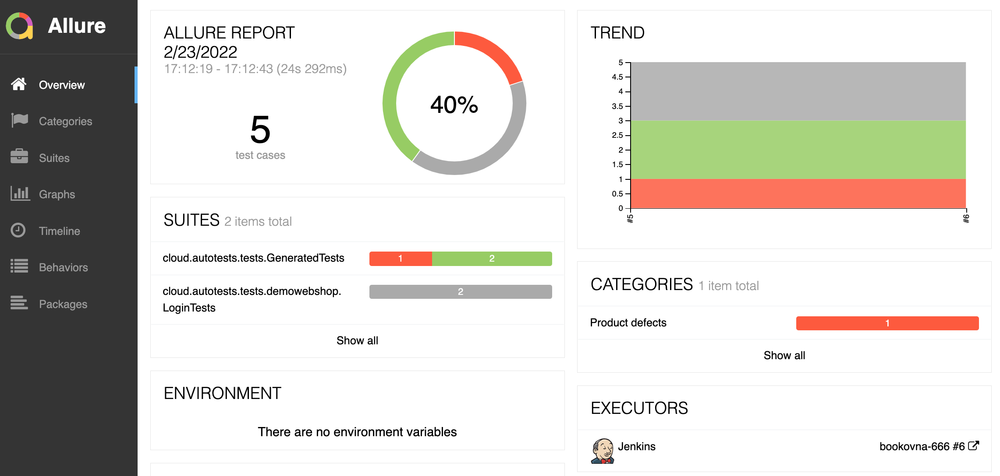
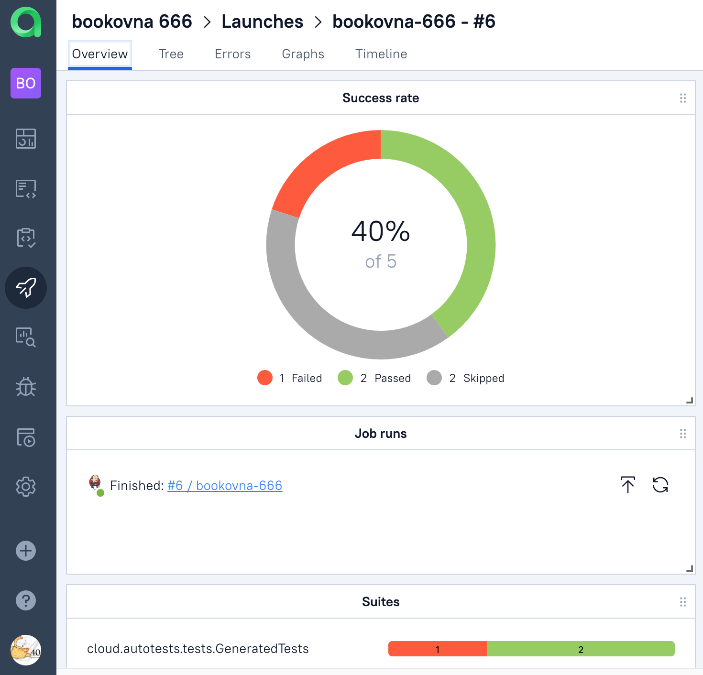
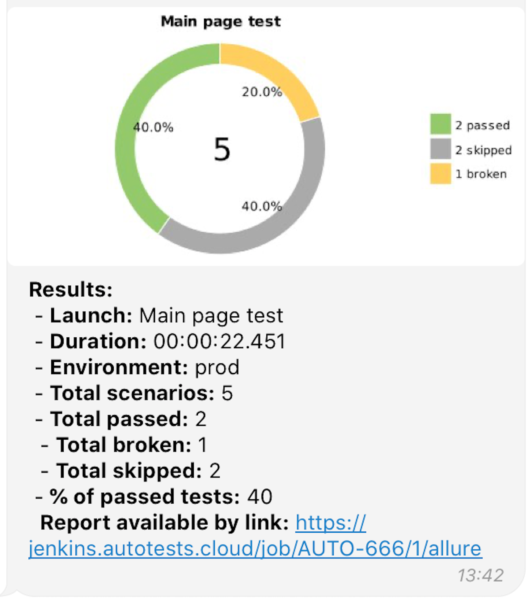

## Проект по разработке автотестов для сайта [Goritskov.com](https://goritskov.com/ "goritskov's home")
### Технологический стек
________
                              

-----
* Автотесты написаны на ``Java`` с использованием фреймворка ``Selenide``
* ``JUnit 5`` фреймворк для модульного тестирования
* ``Gradle`` используется для автоматизированной сборки проекта
* Тесты запускаются с помощью ``Jenkins``
* ``Selenoid`` запускает браузеры в контейнерах ``Docker``
* ``Allure Report`` формирует отчет о запуске тестов
* Автотесты интегрируются с тест-менеджмент системой ``Allure TestOps``
* В ``Telegram`` бот отправляет уведомления о результатах прохождения тестов

###  Тест-кейсы
1. Проверка текста заголовка на главной странице
2. Проверка наличия ссылки на раздел "Обо мне" на странице

### 🚀 Запуск тестов из терминала
* Локально ``gradle clean test -DtypeEnv=locale``
* Удалённо ``gradle clean test -DtypeEnv=remote``

###  Конфигурация Job в Jenkins 
✅ Открыть сборку [Jenkins](https://jenkins.autotests.cloud/job/bookovna-666/build?delay=0sec)  
✅ Кликнуть на **"Build with Parameters"**  
✅ Указать нужные параметры  
✅ Кликнуть на **"Build"** 

  

✅ Чтобы увидеть отчёт о прохождении тестов в Allure Report, нужно кликнуть на иконку **"Allure Report"**  

###  Отчет о результатах тестирования в Allure Report

  
Подробнее
  

   
  

  

###  Интеграция тестов c тест-менеджмент системой [Allure TestOps](https://allure.autotests.cloud/launch/11113)

  
Подробнее
 

  
  
  
  

  

###  Видео прохождения тестов в Selenoid  

<video>
 <source src="video/5e8b77b7342d9aaf.mp4">
<width=180/>
 

###  Уведомления о прохождении тестов в Telegram  

  
